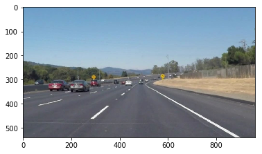
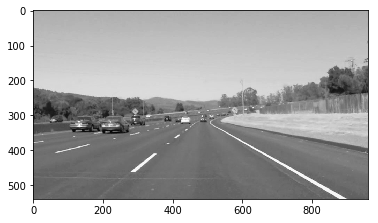

**Run all the cells below to make sure everything is working and ready to go. All cells should run without error.**

### Test Matplotlib and Plotting


```python
import matplotlib.pyplot as plt
import matplotlib.image as mpimg
import numpy as np
%matplotlib inline
```


```python
img = mpimg.imread('test.jpg')
plt.imshow(img)
```


    <matplotlib.image.AxesImage at 0x7f54780cad30>





### Test OpenCV


```python
import cv2
```


```python
# convert the image to grayscale
gray = cv2.cvtColor(img, cv2.COLOR_RGB2GRAY)
plt.imshow(gray, cmap='Greys_r')
```


    <matplotlib.image.AxesImage at 0x7f5478067908>





## Test TensorFlow


```python
import tensorflow as tf
```


```python
with tf.Session() as sess:
    a = tf.constant(1)
    b = tf.constant(2)
    c = a + b
    # Should be 3
    print("1 + 2 = {}".format(sess.run(c)))
```

    1 + 2 = 3


## Test Moviepy


```python
# Import everything needed to edit/save/watch video clips
# import imageio
# imageio.plugins.ffmpeg.download()
from moviepy.editor import VideoFileClip
from IPython.display import HTML
```

Create a new video with `moviepy` by processing each frame to [YUV](https://en.wikipedia.org/wiki/YUV) color space.


```python
new_clip_output = 'test_output.mp4'
test_clip = VideoFileClip("test.mp4")
new_clip = test_clip.fl_image(lambda x: cv2.cvtColor(x, cv2.COLOR_RGB2YUV)) #NOTE: this function expects color images!!
%time new_clip.write_videofile(new_clip_output, audio=False)
```

    [MoviePy] >>>> Building video test_output.mp4
    [MoviePy] Writing video test_output.mp4


    100%|██████████| 251/251 [00:14<00:00, 16.96it/s]


    [MoviePy] Done.
    [MoviePy] >>>> Video ready: test_output.mp4 
    
    CPU times: user 2.06 s, sys: 964 ms, total: 3.02 s
    Wall time: 16.5 s


```python
HTML("""
<video width="640" height="300" controls>
  <source src="{0}" type="video/mp4">
</video>
""".format(new_clip_output))
```


<video width="640" height="300" controls>
  <source src="test_output.mp4" type="video/mp4">
</video>


